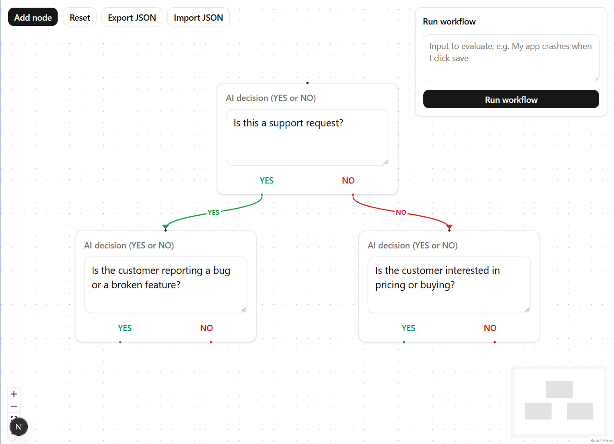
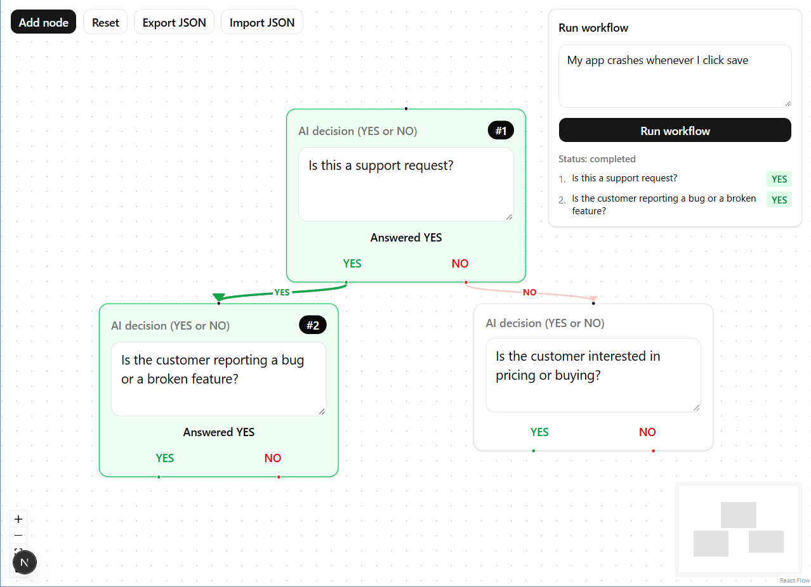

# AI Decision Flow

A visual workflow builder where every node is an AI decision that answers YES or NO. Draw the flow with React Flow, run it, and Inngest executes it one step per node.



## How it works

Each node holds a yes/no question. On run, the question and your input go to an LLM that must reply with exactly `YES` or `NO`. The flow then follows the matching green (YES) or red (NO) edge to the next node. Every node is one Inngest step.

## Features

- Add, drag and connect nodes, edit prompts inline, autosave to local storage
- YES and NO edge types, with one edge per handle
- Inngest execution with strict YES/NO validation, retries, and a loop guard
- Visual execution state with animated active edges
- JSON export and import
- Error handling with the failed node highlighted



## Tech stack

Next.js, TypeScript, React Flow (`@xyflow/react`), Inngest, OpenAI SDK (pointed at Gemini), shadcn/ui, Tailwind CSS

## Setup

Requires Node.js 20.9+ and a Gemini API key from Google AI Studio.

```bash
npm install
cp .env.example .env.local
```

Fill in `.env.local`:

``` console
GEMINI_API_KEY=your_key
GEMINI_MODEL=model_name_from_ai_studio
INNGEST_DEV=1
```

Run in two terminals:

```bash
npm run dev
npx inngest-cli@latest dev -u http://localhost:3000/api/inngest
```

Open <http://localhost:3000> for the app and <http://localhost:8288> for the Inngest dashboard.

## Notes

- Run state is kept in server memory, so it resets when the dev server restarts
- The layout is desktop first and is not optimized for small screens
